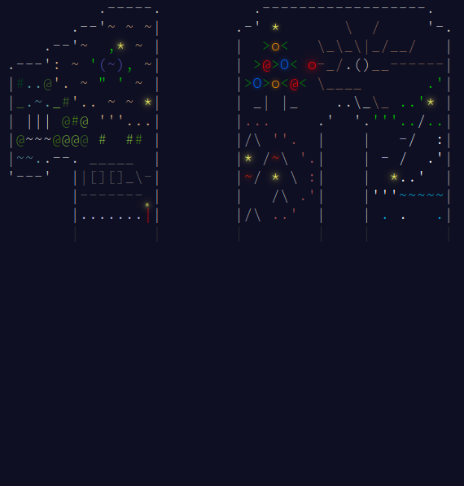
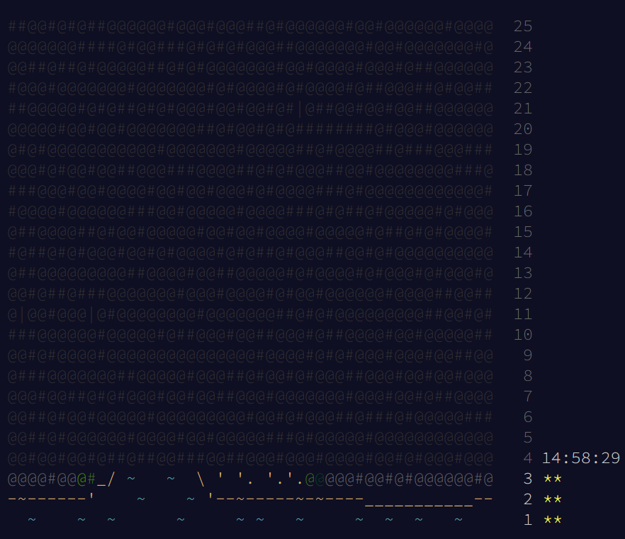
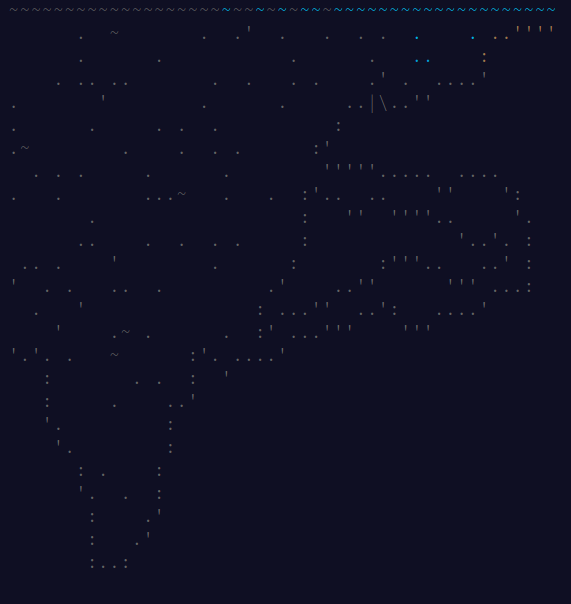
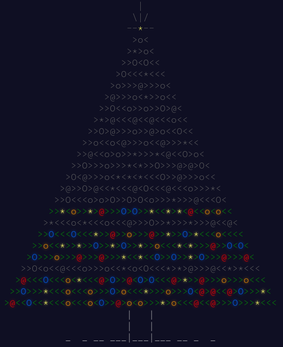

# 🎅 Advent of Code 🎅
## 🎄 Mes solutions aux énigmes Advent of Code 🎄

Advent of code est un calendrier de l'avent créé par **[Eric Wastl](https://twitter.com/ericwastl)**. Pour plus d'informations : [Site Advent Of Code](https://adventofcode.com/).  
Chaque dossier correspond à une année et contient mes solutions aux énigmes et les inputs qui ont été fournis. 

### [Advent of Code 2024](https://github.com/TikSL/Advent-of-Code/tree/main/2024) - 20 ⭐

### [Advent of Code 2023](https://github.com/TikSL/Advent-of-Code/tree/main/2023) - 38 ⭐

### [Advent of Code 2022](https://github.com/TikSL/Advent-of-Code/tree/main/2022) - 21 ⭐

### [Advent of Code 2021](https://github.com/TikSL/Advent-of-Code/tree/main/2021) - 7 ⭐

### [Advent of Code 2015](https://github.com/TikSL/Advent-of-Code/tree/main/2015) - 15 ⭐

