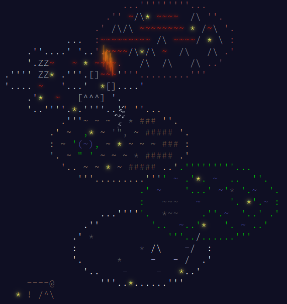
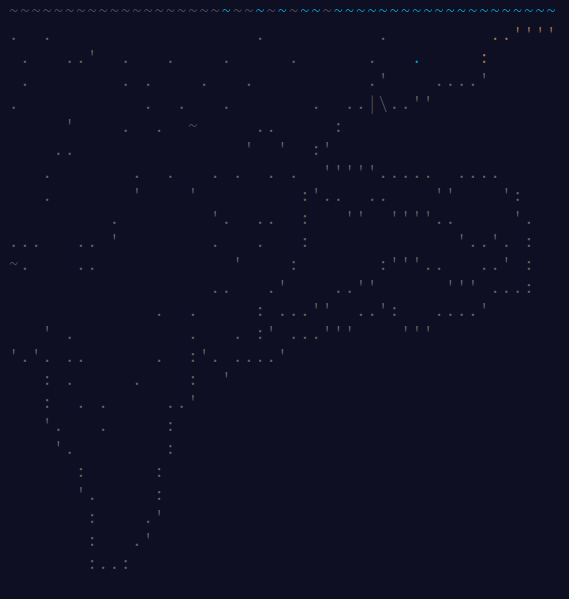

# 🎅 Advent-of-Code 🎅
**🎄 Mes solutions aux énigmes Advent of Code 🎄**

Chaque dossier correspond à une année et contient mes solutions aux énigmes. 

Advent of code est un calendrier de l'avent créé par **[Eric Wastl](https://twitter.com/ericwastl)**. Pour plus d'informations : [Site Advent Of Code](https://adventofcode.com/).

### [Advent of Code 2023](https://github.com/TikSL/Advent-of-Code/tree/main/2023)

### [Advent of Code 2022](https://github.com/TikSL/Advent-of-Code/tree/main/2022)

### [Advent of Code 2021](https://github.com/TikSL/Advent-of-Code/tree/main/2021)

### [Advent of Code 2015](https://github.com/TikSL/Advent-of-Code/tree/main/2015)

